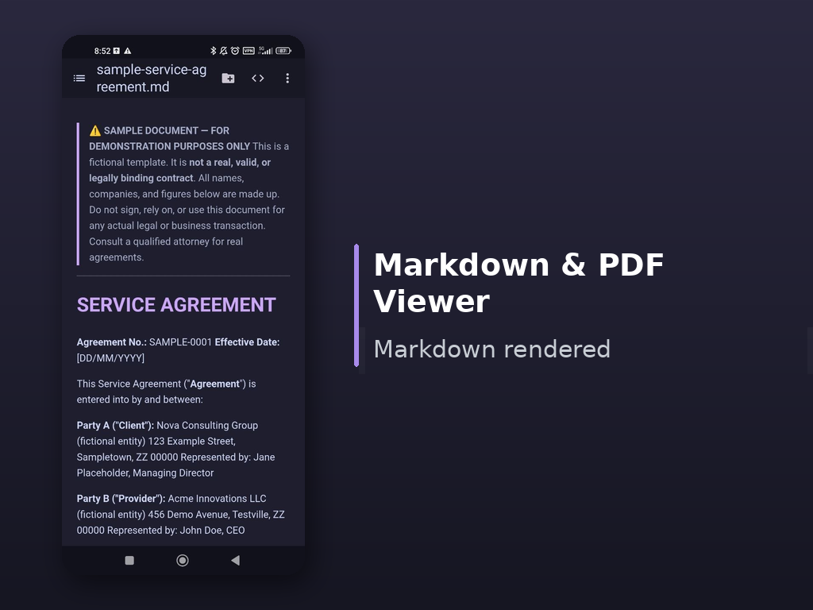
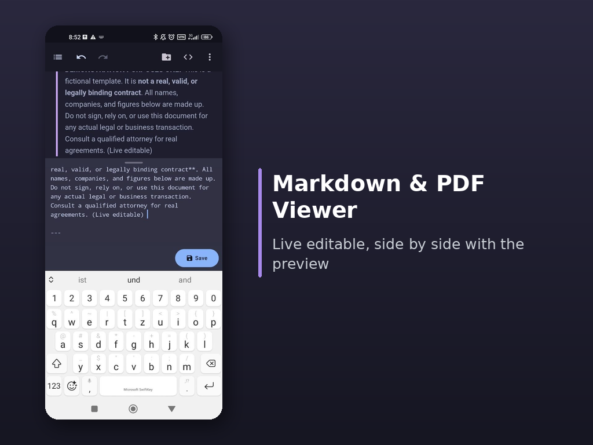
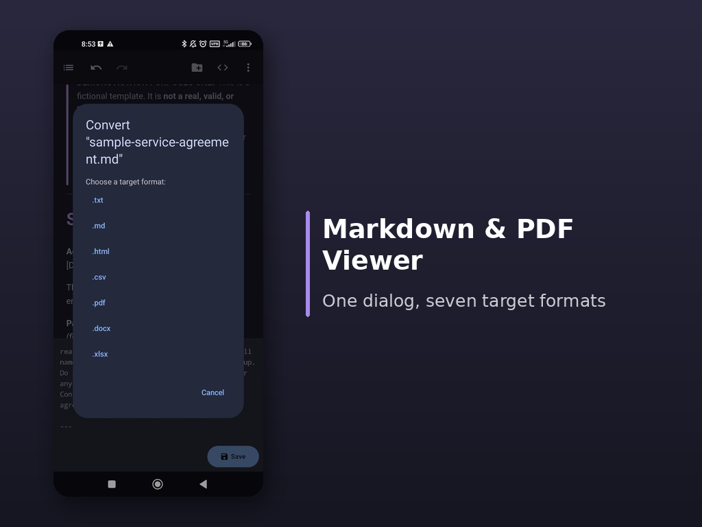
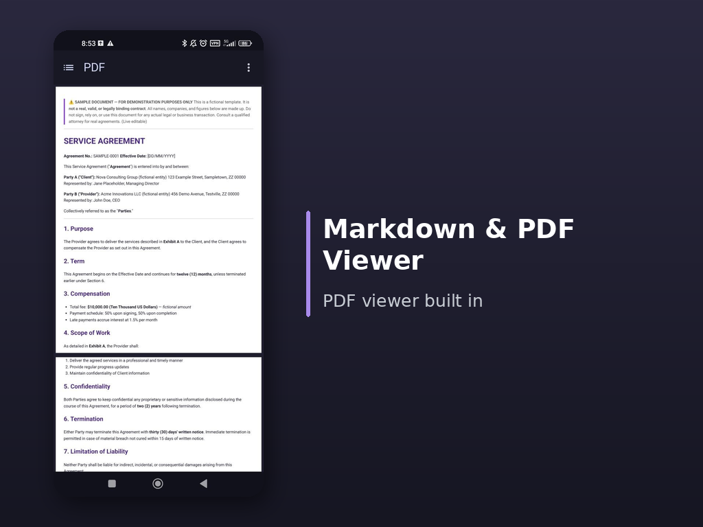

# Read & Convert

**Read. Edit. Convert.** Everything local, offline and without an account. An Android document app that never lets your files leave the device.

Read & Convert is a full-featured editor and converter: it renders Markdown live, reads and writes seven formats and ships with its own PDF viewer. 
No ads, no permissions beyond your files, no network.

## Screenshots

|  |  |
|---|---|
|  |  |
| Live Markdown rendering with TOC, diagrams, code and more. Right on the device. | Split view: type on the Bottom, see the finished document on the Top, no white flash. |
|  |  |
| Built-in 7-format converter using a shared block intermediate format. | Layout-preserving PDF viewer that reconstructs headings, lists and tables. |

## Features

- **Live editor with preview** — rendered output updates as you type, scroll position and zoom are kept
- **7-format converter** — `txt · md · html · csv · pdf · docx · xlsx` through a shared block intermediate format, lossless round trips
- **Own PDF viewer** — a heuristic rebuilds headings, lists, tables and styling from glyph positions instead of flat text; running headers and footers are stripped
- **Full file management** — open from any file manager (`content://` and `file://`), rename/delete via long-press, undo/redo (100 steps)
- **Hardened against everything** — BOM detection, encoding errors, 16-MB read limit, OOM protection, CSV formula neutralization
- **Privacy first** — fully offline, no permissions beyond file access

## Installation

Download the current **APK** from the [Releases](../../releases). Requires at least **Android 8.0 (API 27)**, tested on **Android 14 (API 34)**.

> **Note:** No Play Store version, no auto-updates. New releases appear here. On first install you need to allow installing apps from unknown sources.

## Support

- Problems or feature requests? Open an [Issue](../../issues).

## Privacy & Security

- No network access, no tracking, no analytics.
- Files are processed exclusively on the device.
- Releases are published as signed APK files (details in each release).

---

*Read & Convert is developed as a closed-source app. Only finished APKs are published.*
