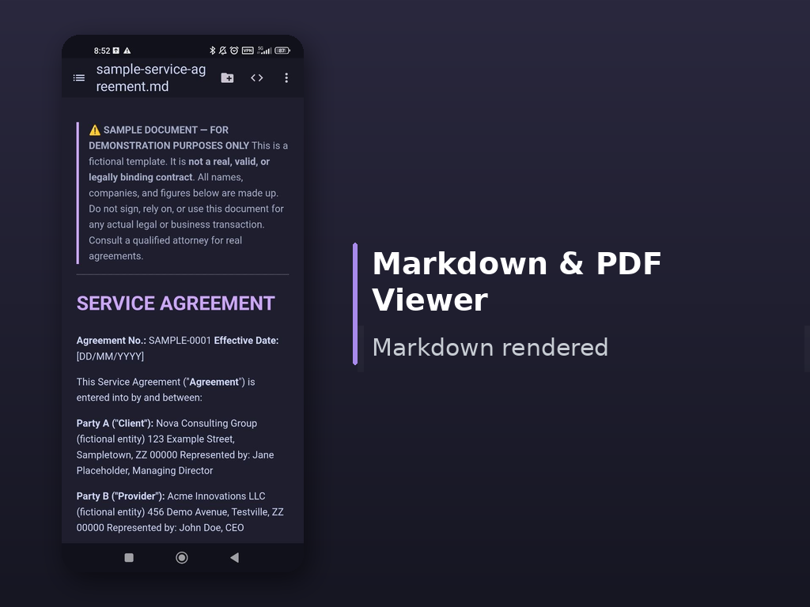
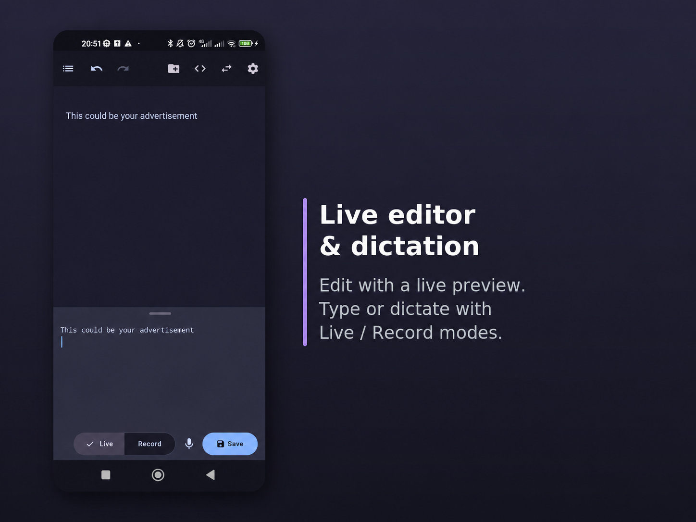
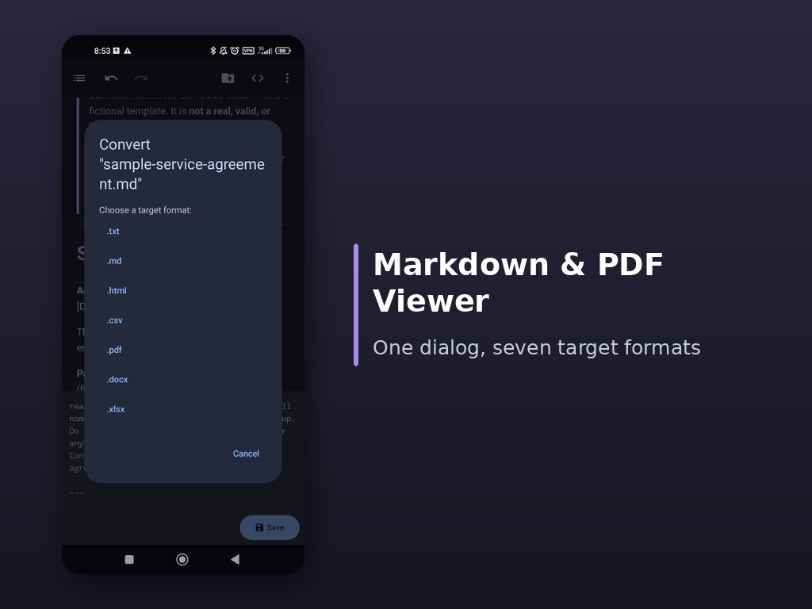
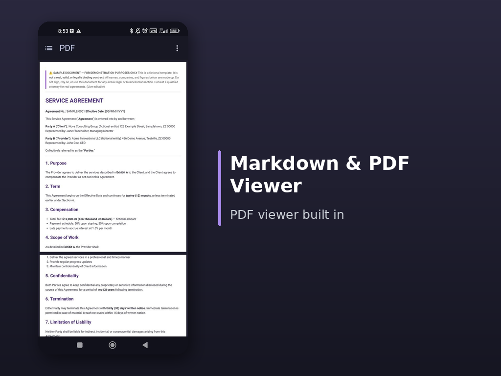

# Read & Convert

**Read. Edit. Convert. Dictate.** An Android app for working with documents on your device, without an account or ads.

Read & Convert combines a Markdown editor with live preview, a PDF viewer and conversion between seven document formats. **Voice-to-text dictation is available in v1.1.0 and is still a work in progress.**

## Screenshots

The four images below show an earlier version. They illustrate the core document features; the editor image does not yet show the new dictation controls.

| 1. Markdown rendering | 2. Live editing |
|---|---|
|  |  |
| Rendered Markdown preview. | Edit below the preview, with undo/redo and save. |

| 3. Format conversion | 4. PDF viewer |
|---|---|
|  |  |
| Choose an output format for your document. | View PDF pages with zoom and navigation. |

### 5. Dictation in the editor (screenshot pending)

**Planned image:** `Project_Images/5_dictation-editor.png`

Show the editor with the microphone control, Live / Record mode selector and recognized text. This screenshot should make the experimental voice-to-text workflow visible.

### 6. Dictation settings and Whisper model (screenshot pending)

**Planned image:** `Project_Images/6_dictation-settings.png`

Show language selection, the bundled/selected Whisper model, model import and benchmark controls. Replace these placeholders with real screenshots of the current app.

## Features

- **Markdown editor with live preview** - edit documents, adjust the editor panel, zoom and use undo/redo.
- **Seven document formats** - convert between `txt`, `md`, `html`, `csv`, `pdf`, `docx` and `xlsx`. Conversion transfers text and basic structure; complex formatting and page layout may change.
- **PDF viewer** - view rendered PDF pages, zoom and navigate through the document.
- **File management** - open folders through Android's file picker, browse files, create documents and rename or delete files with confirmation.
- **Voice-to-text dictation (experimental / work in progress)** - dictate into the editor using Live recognition, or record audio and transcribe it with Whisper. Includes transcription progress, language/model settings and a model benchmark.

## Dictation: work in progress

This is **speech-to-text (STT)**: spoken audio becomes editable text. It is not a text-to-speech reader.

- **Record -> Transcribe (Whisper):** transcription runs inside the app, offline. A Whisper model is bundled; other compatible models can be imported through Android's file picker. Model download links open an external app/browser.
- **Live:** uses Android's SpeechRecognizer. Availability and offline support depend on the device, recognition service and installed language packs. The external recognition service may use the network; offline operation is not guaranteed for this mode.
- Microphone access is requested for dictation. Android may show a recording notification while recording continues in the background.
- Recognition accuracy, device support and workflow polish are still being improved. Check dictated text before saving; mixed German/English speech within one sentence is not guaranteed.

## Installation and updates

Download the latest signed **APK** from [Releases](https://github.com/NomeSame/MarkdownViewer-Releases/releases/latest). Requires **Android 8.1 (API 27)** or newer.

Current release: **v1.1.0** (Android versionCode **2**). It uses the same signing key as v1.0.0 and can update the existing installation. Previous releases remain available.

There is no Play Store version or automatic updater. Install updates manually from this repository. Android may require allowing installation from the app used to open the APK.

## Privacy and permissions

- Document rendering, editing and conversion run on the device.
- The app has no `INTERNET` permission, accounts, ads, tracking or analytics.
- Dictation requires microphone permission; background recording uses a foreground service.
- Whisper transcription stays inside the app. Live recognition is handled by Android's external speech service and may involve that provider's network processing and privacy policy.
- Download links and Android file providers are handled by external apps/services; their behavior is outside this app's control.

## Validation and known limits

The v1.1.0 release build, signature/alignment checks and **550 JVM unit tests** passed. Release lint reports no errors. The last complete device test run passed **204 tests on Android 13** on 4 October 2026. A fresh device run for the release was blocked by USB installation restrictions and was not repeated before publication.

Minimum-version device testing and manual acceptance of the progress indicators remain open. Dictation is experimental; document conversion does not promise lossless layout preservation.

## Support

Report bugs or request features through [Issues](https://github.com/NomeSame/MarkdownViewer-Releases/issues). For dictation issues, include the Android version, recognition mode, language/model and steps to reproduce. Avoid attaching private documents or recordings.

---

*Read & Convert is a closed-source app. This repository distributes signed APKs, release notes and screenshots; it does not contain the app source code.*
